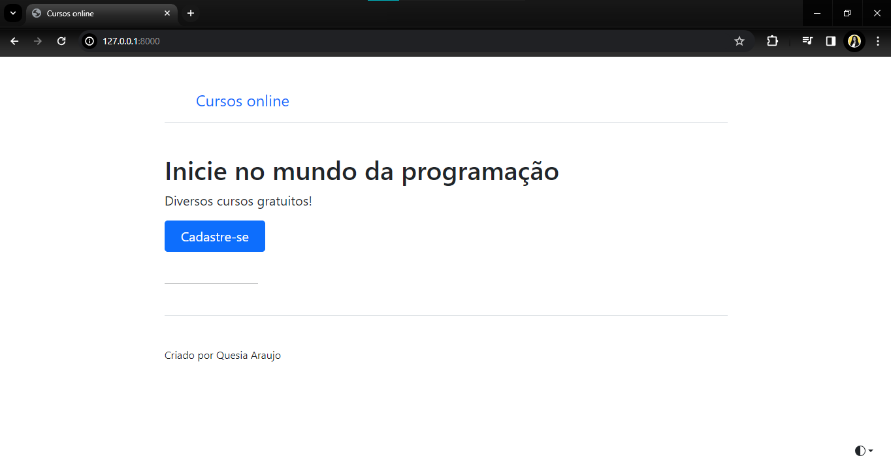

# Plataforma restfull de cursos online

## Sobre o projeto

Este projeto é um sistema de cadastro de cursos, com foco no back-end, desenvolvido com `bootstrap`, implementado em `python`, usando o framework `django` e testado com `pytest` e `postman`. O sistema foi desenvolvido com o intuito de realizar o gerenciamento de cursos online para uma empresa de cursos que oferece diversas opções de aprendizado. O sistema permite que a empresa gerencie os cursos oferecidos na parte administrativa, além de possibilitar a conexão através de outras plataformas para o cadastro de novos cursos e visualização.

### Pagina inicial

### Pagina cadastro de usuario

### Cadastro de cursos

### Painel administrativo djago

### Django integração API Restfull

### Comandos executados apenas na primeira vez:

#### Instalação do ambiente virtual

    pip install virtualenv

#### Criação do ambiente virtual

    python -m  venv .venv

#### Instalação do Django

    pip install django

### Comandos para modificar o projeto

#### Ativação do ambiente virtual

    .venv/Scripts/ativate

#### Comando para criação de um projeto django

    django-admin startproject nome_do_projeto .

#### Comando para rodar um projeto django

    python  manage.py  runserver

#### Comando para criação de um app

    python manage.py startapp base
